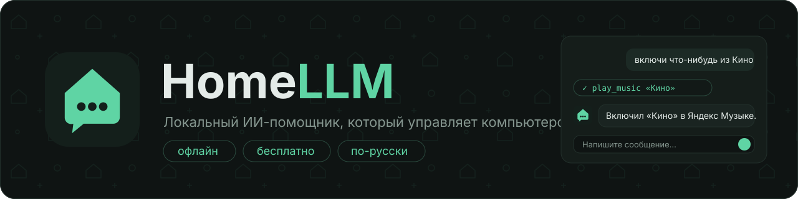

<p align="center">
  
</p>

<p align="center">
  
  
  
  
</p>

<p align="center"><b><a href="docs/QUICKSTART.md">Как запустить</a></b> · <a href="#что-уже-работает">Что умеет</a> · <a href="#планы">Планы</a></p>

# HomeLLM

Локальный ИИ-помощник для компьютера. Выбираешь модель из каталога — она скачивается на ПК,
работает без интернета и без подписок и умеет управлять компьютером: включить музыку, переключить
трек, убавить звук, открыть сайт или программу.

## Зачем, если есть LM Studio и Open Interpreter

Всё это уже существует, но по кускам и для программистов: LM Studio, Jan и Ollama запускают модели,
Open Interpreter и Goose управляют компьютером, OVOS и Rhasspy слушают голос — и каждое надо
ставить и настраивать отдельно, через консоль и конфиги.

HomeLLM собирает это в одно приложение для обычного человека:

- **одна кнопка** — выбрал модель, она сама скачалась и запустилась, никаких конфигов;
- **по-русски из коробки** — русские промпты, Яндекс Музыка, модели, проверенные на русском;
- **безопасно** — понятные уровни риска и подтверждение вместо «модель выполняет любой код»;
- **телефон как пульт** для ПК (в планах).

Цель — одно приложение для Windows, macOS, Linux, Android и iOS. Сейчас есть окно (Tauri) и консольная
версия для Windows/Linux/macOS.

## Что уже работает

- **Окно**: вкладки «Модели» (железо, каталог, загрузка с прогрессом, запуск), «Чат» (ответ по мере
  генерации, видно, какие действия выполняются) и «Настройки»; рискованные действия — через диалог.
- **Каталог моделей** (`catalog/models.json`, 35 штук, все бесплатные): для разговора — Qwen3/3.5/3.6/3.8,
  Gemma 3/4, Llama 3.2, LFM 2.5, Phi-4 mini, Mistral Small 3.2, gpt-oss 20B; для кода — Qwen2.5 Coder и
  Qwen3 Coder 30B; сторонние сборки Jev (Jev-Style, JevK5, Jev-Omni, jevify Gemma 4, NeoHorse Jev);
  для голоса — Whisper (распознавание) и русские голоса Piper (озвучка, заработают вместе с голосовым
  режимом). Вживую проверены не все — список проверенных будет в каталоге.
- **Всегда под рукой**: значок в трее (открыть, новый чат, выход), закрытие окна прячет его в трей — модель остаётся загруженной; **Alt+Space** в любой программе показывает или прячет HomeLLM; опция «запускать вместе с Windows».
- **Сценарии**: «запомни режим кино: громкость 30 и открой YouTube» — потом одной фразой «режим кино». Рискованные шаги по-прежнему спрашивают подтверждение.
- **Свои модели**: любой .gguf из папки моделей или по пути появляется в «Своих моделях» и запускается как обычная; кнопка «Открыть папку моделей».
- **Чаты**: история сохраняется, поиск по чатам, экспорт в Markdown, чаты можно переименовать и удалить; при запуске сама загружается последняя
  модель. Четыре темы оформления.
- **Всё — и из чата**: «какие модели есть», «скачай qwen3.5-9b», «переключись на gemma4-12b», «поставь тему
  фиалка», «поставь папку музыки D:\Music».
- **Проверка железа**: память и видеокарта любого производителя (NVIDIA, AMD, Intel, Apple). Для каждой
  модели видно, пойдёт ли она быстро (на видеокарте), медленно (на процессоре) или не влезет; самая
  подходящая предлагается сама.
- **Загрузка** с докачкой после обрыва и проверкой sha256.
- **Встроенный движок** — llama.cpp на видеокарте: Vulkan на Windows и Linux, Metal на macOS. Если модель
  не влезает в видеопамять, считает на процессоре. Можно вместо него подключить Ollama, LM Studio или
  любой OpenAI-совместимый сервер.
- **Управление ПК** через вызов инструментов (tool calling):

  | Инструмент | Что делает | Подтверждение |
  |---|---|---|
  | `media` | пауза/продолжить, следующий/предыдущий трек, громкость, выключить звук | нет |
  | `play_music` | включить песню: файл из `HOMELLM_MUSIC_DIR` или поиск в Яндекс Музыке | нет |
  | `open_url` | открыть сайт (только http/https) | нет |
  | `open_app` | запустить программу | **да** |
  | `set_volume` | громкость на N% | нет |
  | `clipboard_read` / `clipboard_write` | прочитать или положить текст в буфер обмена | нет |
  | `remind` | напомнить через N минут — уведомление Windows, переживает перезапуск | нет |
  | `system_info` | время, ОС, память | нет |

  Всё, что может навредить, выполняется только после «да» от пользователя.

## Сборка

Пошаговая инструкция с нуля для Windows: [docs/QUICKSTART.md](docs/QUICKSTART.md).


Нужны Rust (stable), CMake, компилятор C++ (Windows: Visual Studio Build Tools с C++, macOS: Xcode CLT),
LLVM (libclang нужен для привязок к llama.cpp) и, на Windows и Linux, [Vulkan SDK](https://vulkan.lunarg.com/)
с переменной `VULKAN_SDK`.

```bash
cargo build --release
```

Получаются `target/release/homellm-app` (окно) и `target/release/homellm` (консоль).

Тесты: `cargo test -p homellm-core` — цикл агента на подставной модели (вызов инструмента, переспрос при
выдуманном действии, отказ в подтверждении, инструменты приложения), разбор ответов и целостность каталога
(уникальные id, ссылки, sha256).

- Только процессор, без Vulkan SDK: `cargo build --release -p homellm-cli --no-default-features --features llama-cpu`
  (для окна — `-p homellm-app --no-default-features`).
- CUDA вместо Vulkan (чуть быстрее на NVIDIA, нужен CUDA Toolkit): `--no-default-features --features cuda`.
- На Windows, если bindgen не находит libclang: `set LIBCLANG_PATH=C:\Program Files\LLVM\bin`.
- На Windows первая сборка с Vulkan иногда падает на `vulkan-shaders-gen` (ошибка MSB8066) — просто
  запустите `cargo build` ещё раз.

## Использование

Окно: запустите `homellm-app`, на вкладке «Модели» скачайте рекомендованную модель и нажмите «Запустить».

Консоль:

```bash
homellm hw                  # железо и рекомендованная модель
homellm models              # каталог: размер, пойдёт ли, скачана ли
homellm pull qwen3-8b       # скачать
homellm chat                # разговор с самой большой скачанной моделью
homellm chat --model qwen3-4b
homellm chat --server http://localhost:11434 --server-model qwen3:8b   # через Ollama
```

Пример:

```
> включи что-нибудь из Кино
  → play_music {"query":"Кино"}
  ← открыт поиск: https://music.yandex.ru/search?text=%D0%9A%D0%B8%D0%BD%D0%BE
Включил поиск «Кино» в Яндекс Музыке.
```

Настройки — во вкладке «Настройки» окна или через переменные окружения (они важнее):

- `HOMELLM_MODELS_DIR` — куда класть модели (по умолчанию папка данных приложения);
- `HOMELLM_MUSIC_DIR` — папка с музыкой, в ней `play_music` ищет файлы в первую очередь;
- `HOMELLM_MUSIC_SEARCH` — сайт для поиска музыки (по умолчанию `https://music.yandex.ru/search?text=`).

## Устройство

```
catalog/models.json        каталог моделей (ссылки, размеры, sha256)
crates/homellm-core        ядро без интерфейса
  catalog.rs               каталог, «пойдёт ли модель», рекомендация
  hardware.rs              память, видеокарта
  download.rs              загрузка с докачкой и проверкой
  engine/                  движки: llama.rs (встроенный), openai.rs (Ollama, LM Studio)
  tools/                   инструменты управления ПК и их уровни риска
  agent.rs                 цикл «модель → инструмент → результат → ответ»
  settings.rs              настройки пользователя (JSON)
crates/homellm-app         окно на Tauri 2: src/main.rs — команды и события, ui/ — интерфейс
crates/homellm-cli         консольная оболочка
```

Инструменты вызываются по текстовому протоколу `<tool_call>{"name": …, "arguments": …}</tool_call>`:
это формат Hermes/Qwen, его понимают почти все небольшие модели, и он одинаково работает с любым движком.

## Планы

1. **Голос**: распознавание через whisper.cpp, озвучка через Piper, фраза для активации — всё офлайн.
2. **Горячая клавиша** и всплывающее окно поверх всех окон.
3. **MCP**: подключение готовых MCP-серверов как инструментов.
4. **Память** о пользователе (SQLite) и поиск по своим файлам.
5. **Больше инструментов**: Spotify и Яндекс Музыка по API, таймеры и напоминания, буфер обмена,
   скриншот с разбором экрана, умный дом (Home Assistant).
6. **Мобильные версии**: на телефоне — модели 1–4B. iOS не даёт управлять чужими приложениями,
   Android — частично, поэтому там же режим «пульта» для ПК.

## Участие

Изменения — только через pull request, и перед началом работы согласуйте задачу с владельцем
репозитория ([@dzotyara](https://github.com/dzotyara)). См. [CONTRIBUTING.md](CONTRIBUTING.md).

## Лицензия

MIT — см. [LICENSE](LICENSE). Модели из каталога распространяются по своим лицензиям (Apache 2.0, Gemma, Llama и др.) — смотрите страницу модели на Hugging Face.
